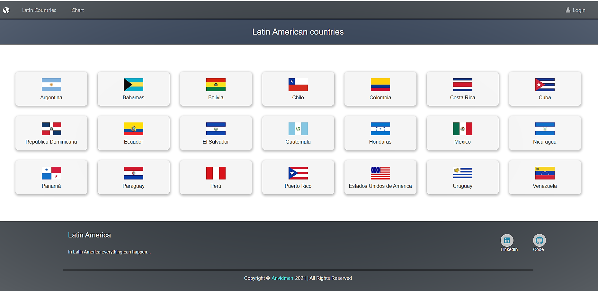
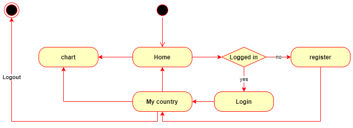
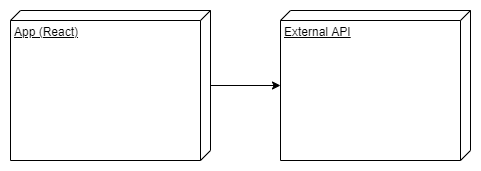
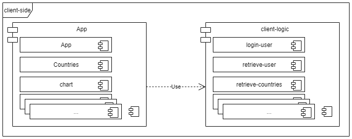
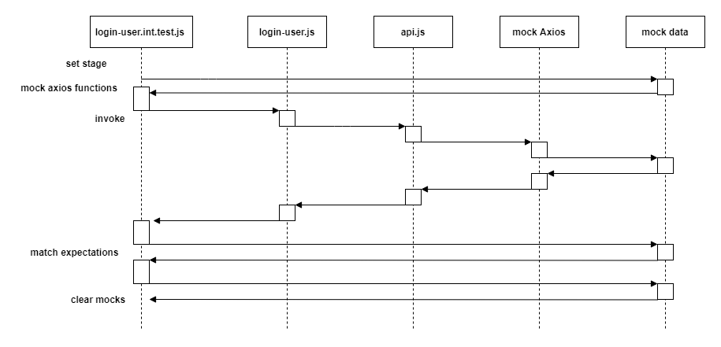
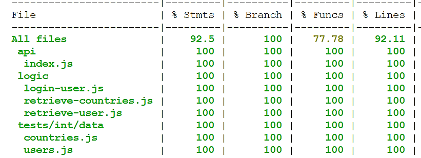

# Countries Chart



## Description

It is an application that shows flags of Latin American countries and a comparative graph of the telephone prefixes of some countries in the world.

## Functional description

The application **Countries Chart** has 3 screens:

 1. Information about Latin American countries, their name and their respective flag is displayed.

 2. A comparison chart of the phone codes is displayed in descending order.

 3. Login, when entering, the flag of the user's country of origin will be displayed with a representative color compared to the other flags.

### Activities



## Technical description

### Blocks



## Modules / Components



## Sequences

Testing



## Code Coverage

Client-side



## Instructions

### Client-side

#### Testing

In the module run:

```sh
$ npm test
```

#### Code Coverage

```sh
$ npm run test:coverage
```

### Run

In the module run:

```sh
$ npm start
```

### Enter

```sh
$ open http://localhost:3000/
```
